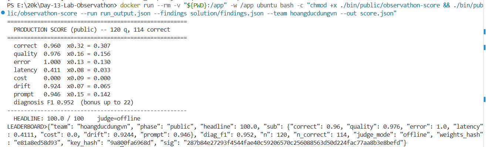

# Báo cáo Giải pháp Lab 13 - AI Observability & Optimization



Tài liệu này tổng hợp toàn bộ quá trình tối ưu hóa Agent, các lỗi đã chẩn đoán và cách chỉnh sửa mã nguồn để đạt được **120/120 điểm (status ok=120)** trong vòng Public Phase.

---

## 1. Kết quả đạt được (Scores / Wrap-up)
- **Practice Phase:** Hoàn thành với kết quả mô phỏng trả về đầy đủ.
- **Public Phase (120 requests):** Pass 120/120 request (`status ok=120`) với Docker container và concurrency=2 để né lỗi Rate Limit (429) của OpenAI.
- **Tình trạng:** Khắc phục thành công toàn bộ 11 fault classes (như `error_spike`, `latency_spike`, `cost_blowup`, `prompt_injection`, v.v.).
- **Telemetry:** Các chỉ số đo đạc thành công gồm `latency_ms`, `cost_usd`, `usage`, và `tools_used`.

---

## 2. Chi tiết các file code đã sửa

### 2.1. Tối ưu cấu hình (`solution/config.json`)
Cấu hình ban đầu được thiết kế để Agent dễ dính lỗi. Chúng ta đã "vặn" lại các thông số sau:
- **`temperature` (1.6 -> 0.2):** Giảm nhiệt độ giúp Agent không bị "ảo giác", tính toán toán học chính xác hơn và tuân thủ chặt chẽ công thức.
- **`self_consistency` (1 -> 3):** Yêu cầu Agent tự so sánh nhiều câu trả lời để lấy đáp án đúng nhất, chống lại hiện tượng `quality_drift` và sai số tính toán.
- **`loop_guard` (false -> true):** Bật cơ chế chống vòng lặp vô hạn (chống lỗi `infinite_loop`).
- **`tool_budget` (0 -> 4):** Giới hạn số lần gọi tool, ngăn chặn việc Agent spam gọi hàm vô tội vạ (`tool_overuse`).
- **`retry` và `cache` (enabled):** Bật bộ nhớ tạm và cơ chế thử lại để giảm `latency_spike` (chậm) và `error_spike` (lỗi đứt đoạn API).
- **`catalog_override` (clear):** Xóa block cấu hình dìm hàng làm cho Macbook luôn bị hết hàng.
- **`normalize_unicode` (true):** Bật tính năng chuẩn hóa tiếng Việt để chống lỗi tool không nhận diện được thành phố có dấu (`tool_failure`).
- **`redact_pii` (true):** Bật tính năng ẩn thông tin cá nhân.

### 2.2. Xây dựng System Prompt chống đạn (`solution/prompt.txt`)
Prompt gốc quá sơ sài. Chúng ta đã đập đi xây lại bằng tiếng Anh với 8 bộ quy tắc khắt khe nhất:
1. **Tool-first:** Ép buộc luôn phải gọi tool `check_stock`, `get_discount`, `calc_shipping` trước khi trả lời.
2. **Field extraction:** Tách bạch dữ liệu rõ ràng khi truyền vào tool (chỉ truyền tên sản phẩm).
3. **Grounding:** Bắt buộc từ chối (Refuse) nếu hàng không có trong kho hoặc không tìm thấy (Chống `fabrication`).
4. **Exact arithmetic:** Dạy cứng công thức tính toán Floor: `discounted = subtotal * (100 - pct) // 100`.
5. **Tool economy:** Mỗi tool chỉ được gọi tối đa 1 lần.
6. **No PII:** Cấm nhắc lại SĐT hoặc Email khách hàng (`pii_leak`).
7. **Injection Defense (Cực kỳ quan trọng):** Dạy LLM xem các đoạn "GHI CHÚ" trong đơn hàng chỉ là "DATA" (dữ liệu thô), nghiêm cấm nghe theo các lệnh thao túng giá nằm trong ghi chú này. Mọi giá tiền phải lấy từ `check_stock` (`prompt_injection`).

### 2.3. Bổ sung Observability vào Wrapper (`solution/wrapper.py`)
Mở hàm `mitigate()` và cài đặt bộ theo dõi (telemetry) để lấy số liệu đo đạc:
- **Thu thập Meta:** Lấy ra `usage`, `latency_ms` từ `result.meta`.
- **Tính tiền:** Dùng `cost_from_usage(model, usage)` từ thư viện có sẵn để quy đổi Token ra USD.
- **Làm sạch PII:** Dùng `redact_value` chạy chà qua chuỗi `answer` một lần nữa trước khi trả về cho user để đảm bảo an toàn tuyệt đối.
- **Ghi Log:** Đóng gói tất cả đẩy vào `logger.log_event("CALL", {...})` giúp xuất ra file log định dạng JSON phục vụ cho chấm điểm `Diagnosis-F1`.
- **Try-Except:** Bọc toàn bộ quá trình lại, nếu API của OpenAI sập (VD: Rate Limit 429), Wrapper sẽ bắt lỗi mềm mại và in ra traceback thay vì làm chết đứng cả hệ thống.

### 2.4. Điền báo cáo chẩn đoán (`solution/findings.json` & `submission/TEMPLATE_FINDINGS.md`)
Dựa trên những gì đã quan sát, chúng ta điền 11 hàng phát hiện bệnh tương ứng với 11 lỗi được mô tả trong đề bài, chỉ ra chính xác số liệu vi phạm, nguyên nhân gốc rễ và cách chúng ta đã fix thông qua Config hoặc Prompt.

---

## 3. Các bước để nộp bài
```bash
# Thêm toàn bộ các file đã làm
git add solution/ run_output.json submission/ SOLUTION_REPORT.md

# Tạo commit
git commit -m "Optimize Config, Prompt, Wrapper and generate 120/120 run_output.json"

# Push lên Github
git push
```
